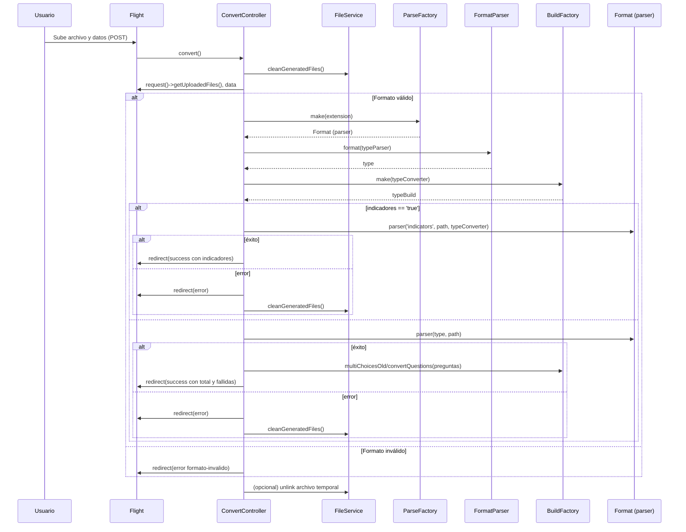

# Diagrama de Secuencia: Conversión de PDF a Moodle XML

Este diagrama documenta el flujo principal del método `convert()` en el `ConvertController`.

```mermaid
sequenceDiagram
    participant Usuario
    participant Flight
    participant ConvertController
    participant FileService
    participant ParseFactory
    participant FormatParser
    participant BuildFactory

    Usuario->>Flight: Sube archivo y datos (POST)
    Flight->>ConvertController: convert()
    ConvertController->>FileService: cleanGeneratedFiles()
    ConvertController->>Flight: request()->getUploadedFiles(), data
    alt Formato válido
        ConvertController->>ParseFactory: make(extension)
        ParseFactory-->>ConvertController: Format (parser)
        ConvertController->>FormatParser: format(typeParser)
        FormatParser-->>ConvertController: type
        ConvertController->>BuildFactory: make(typeConverter)
        BuildFactory-->>ConvertController: typeBuild
        alt indicadores == 'true'
            ConvertController->>Format (parser): parser('indicators', path, typeConverter)
            alt éxito
                ConvertController->>Flight: redirect(success con indicadores)
            else error
                ConvertController->>Flight: redirect(error)
                ConvertController->>FileService: cleanGeneratedFiles()
            end
        else
            ConvertController->>Format (parser): parser(type, path)
            alt éxito
                ConvertController->>BuildFactory: multiChoicesOld/convertQuestions(preguntas)
                ConvertController->>Flight: redirect(success con total y fallidas)
            else error
                ConvertController->>Flight: redirect(error)
                ConvertController->>FileService: cleanGeneratedFiles()
            end
        end
    else Formato inválido
        ConvertController->>Flight: redirect(error formato-invalido)
    end
    ConvertController->>FileService: (opcional) unlink archivo temporal
```
